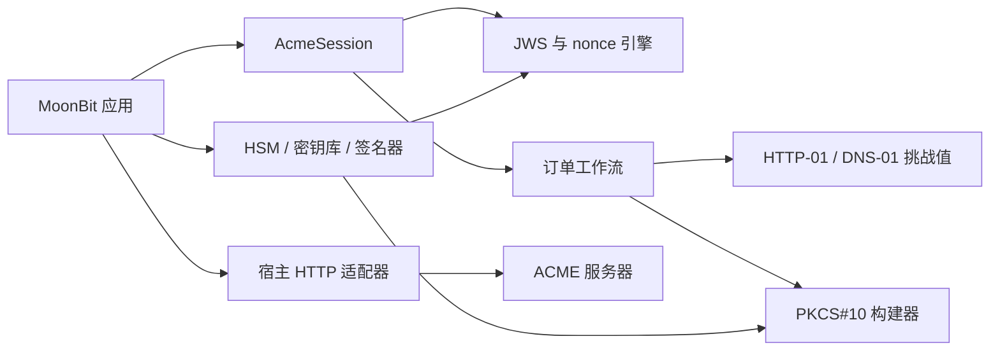

# MoonACME

MoonACME 是使用 MoonBit 实现的可移植 ACME（自动证书管理环境）协议核心，遵循 [RFC 8555](https://www.rfc-editor.org/rfc/rfc8555.html)。它为原生、JavaScript 和 WebAssembly 应用提供申请与续期 TLS 证书所需的协议能力，无需调用 Certbot，也不绑定特定的 HTTP 客户端、DNS 服务商、时钟或私钥存储方案。

当前 0.1 版覆盖完整的请求规划流程：目录发现、账户、订单、授权、HTTP-01 与 DNS-01 挑战、重放随机数、扁平化 JWS、`badNonce` 重试、PKCS#10 CSR 生成、订单终结、证书下载、证书吊销和确定性续期调度。

## 为什么需要协议核心？

MoonBit Web 服务器已经能够加载证书文件，密码学包也能够生成哈希和签名；生态中缺少的是把这些部件安全连接起来的 ACME 状态机。MoonACME 专注于这一层，将网络访问和私钥策略交给宿主应用，从而保持核心库小巧、可复用，并适配不同运行目标。



## 快速开始

克隆仓库并运行严格测试：

```sh
git clone https://github.com/apoloe4/moonacme.git
cd moonacme
moon update
moon test --deny-warn --target wasm
```

使用内置命令生成挑战材料：

```sh
moon run cmd/main -- dns01-name '*.example.com'
moon run cmd/main -- dns01-value TOKEN ACCOUNT_JWK_THUMBPRINT
moon run cmd/main -- http01-path TOKEN
moon run cmd/main -- http01-body TOKEN ACCOUNT_JWK_THUMBPRINT
```

这些能力也可以直接作为库函数调用：

```moonbit nocheck
///|
let record = @moonacme.dns01_record_name("*.example.com")

///|
let value = @moonacme.dns01_txt_value(token, account_thumbprint)

///|
let resource = @moonacme.Http01Resource::new(token, account_thumbprint)
```

`AcmeSession` 会确保每个重放随机数只使用一次，并生成可交给任意签名器处理的签名输入：

```moonbit nocheck
let session = @moonacme.AcmeSession::new(
  directory~,
  algorithm="ES256",
  public_jwk=canonical_public_jwk,
)
session.offer_nonce(replay_nonce) |> ignore
let draft = session.prepare_new_account(["mailto:ops@example.com"], true)
let signature = account_signer(draft.draft.signing_input)
let request = draft.finish(signature[:])
```

解析订单后，调用 `order.next_action()` 可得到 `FetchAuthorizations`、`Finalize`、`Poll`、`DownloadCertificate` 或 `Stop`。宿主应用负责执行相应操作，把响应交回库中，并可在多次运行之间持久化待执行动作。

## 设计保证

- 严格解码器会报告失败字段及所在阶段。
- 保留未知状态和挑战类型，便于向前兼容。
- nonce 只消费一次，`badNonce` 重试次数有明确上限。
- JWS 与 JSON 输出具有确定性，Base64URL 编码不包含填充字符。
- 私钥不会进入协议模型或调试输出。
- 续期规划使用注入的时间，使测试、调度器和生产行为保持一致。
- 同一套测试会在 CI 中覆盖 `wasm`、`wasm-gc`、`js` 和 `native` 目标。

## 项目状态

MoonACME 0.1 可用于构建和测试 ACME 集成。当前提供与传输层无关的 API，尚未内置可直接使用的 HTTP 客户端、DNS 服务商插件或 Pebble 互操作任务。

进一步资料：

- [开发路线图](docs/ROADMAP.md)
- [协议指南](docs/PROTOCOL.md)
- [安全模型](docs/SECURITY.md)
- [测试说明](docs/TESTING.md)
- [比赛项目申报书](docs/PROJECT_PROPOSAL.md)

本项目采用 Apache-2.0 许可证。
