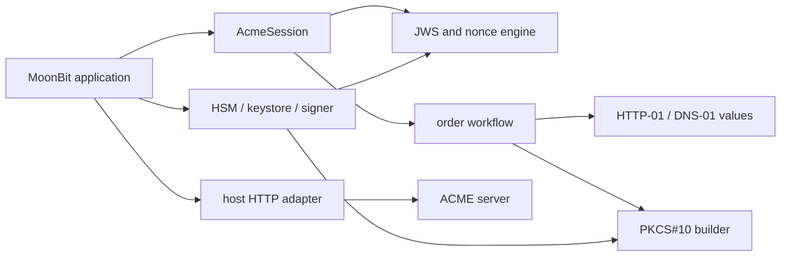

# MoonACME

MoonACME is a portable implementation of the Automatic Certificate Management
Environment protocol ([RFC 8555](https://www.rfc-editor.org/rfc/rfc8555.html))
for MoonBit. It gives native, JavaScript, and WebAssembly applications the
protocol pieces needed to obtain and renew TLS certificates without invoking
Certbot or binding the application to one HTTP client, DNS provider, clock, or
private-key store.

The 0.1 API covers the complete request-planning path: directory discovery,
accounts, orders, authorizations, HTTP-01 and DNS-01 challenges, replay nonces,
flattened JWS, `badNonce` retries, PKCS#10 CSR creation, finalization,
certificate download, revocation, and deterministic renewal scheduling.

## Why a protocol core?

MoonBit web servers can already load certificate files, and cryptography
packages can already produce hashes and signatures. The missing layer is the
ACME state machine that connects those parts safely. MoonACME keeps that layer
small and reusable while leaving network and secret-key policy to the host.



## Quick start

Clone the repository and run the strict suite:

```sh
git clone https://github.com/apoloe4/moonacme.git
cd moonacme
moon update
moon test --deny-warn --target wasm
```

Generate challenge material from the bundled helper:

```sh
moon run cmd/main -- dns01-name '*.example.com'
moon run cmd/main -- dns01-value TOKEN ACCOUNT_JWK_THUMBPRINT
moon run cmd/main -- http01-path TOKEN
moon run cmd/main -- http01-body TOKEN ACCOUNT_JWK_THUMBPRINT
```

The same operations are available as library calls:

```moonbit nocheck
///|
let record = @moonacme.dns01_record_name("*.example.com")

///|
let value = @moonacme.dns01_txt_value(token, account_thumbprint)

///|
let resource = @moonacme.Http01Resource::new(token, account_thumbprint)
```

An `AcmeSession` consumes each replay nonce once and prepares a request whose
signing input can be sent to any signer:

```moonbit nocheck
let session = @moonacme.AcmeSession::new(
  directory~,
  algorithm="ES256",
  public_jwk=canonical_public_jwk,
)
session.offer_nonce(replay_nonce) |> ignore
let draft = session.prepare_new_account(["mailto:ops@example.com"], true)
let signature = account_signer(draft.draft.signing_input)
let request = draft.finish(signature[:])
```

After decoding an order, call `order.next_action()` to obtain one of
`FetchAuthorizations`, `Finalize`, `Poll`, `DownloadCertificate`, or `Stop`.
The host executes that effect, feeds the next response back into the library,
and can persist the action between runs.

## Design guarantees

- Strict decoders report the field and stage that failed.
- Unknown status and challenge strings are preserved for forward compatibility.
- Nonces are consumed exactly once and `badNonce` retries are bounded.
- JWS and JSON output is deterministic and base64url padding is omitted.
- Private keys never enter protocol models or debug output.
- Time is injected into renewal planning, so tests and schedulers agree.
- The same suite runs on `wasm`, `wasm-gc`, `js`, and `native` in CI.

## Project status

MoonACME 0.1 is suitable for building and testing ACME integrations. It has a
transport-neutral API and does not yet ship a ready-made HTTP client, DNS
provider plugin, or Pebble interoperability job. See [Roadmap](docs/ROADMAP.md),
[protocol guide](docs/PROTOCOL.md), [security model](docs/SECURITY.md), and
[testing notes](docs/TESTING.md).

Licensed under Apache-2.0.
